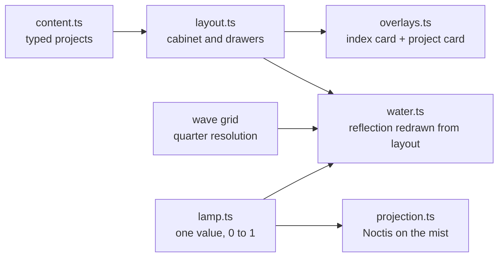

# Portfolio Platform

My portfolio: one night scene in which a library card catalogue stands in still water, lit by a lamp. Each drawer is a project. The lamp is Noctis, the workflow system that drives my daily development.

<p align="center">
  <a href="https://shayneyong.vercel.app"></a>
  
  
</p>

**Live: [shayneyong.vercel.app](https://shayneyong.vercel.app)**

## What it is

The page opens dark. After a moment the lamp flickers on and its light catches the silver fittings of a card catalogue standing in the sea. Open a drawer and an index card rises out of it, with the project's card beside it: what it is in plain words, how it works, what it solves, and the tools. Click the lamp and it tilts and projects Noctis onto the mist, with a diagram of how it fits together.

There are eight small things hidden in the scene. None of them is needed to read the portfolio. The bottle keeps count.

## How it is built

- **No framework, no WebGL, no runtime dependencies.** Vite and TypeScript, hand-written CSS and two canvases. The whole page is about 23 KB gzipped (13.5 KB JavaScript, 6 KB CSS, 3.5 KB HTML) plus fonts.
- **The water is a simulation.** A height grid at a quarter of screen resolution runs the 2D wave equation (Hugo Elias's ripple method: each cell becomes the average of its neighbours minus its previous value, then damps). Its slope refracts, at half resolution, a reflection that is redrawn upside down from the cabinet's real layout into a hidden canvas. Clicking the water drops a ripple through the reflection. The grid sleeps when the surface is flat; the scene holds 60 fps and pauses when the tab is hidden, the scene is off screen or a card is open.
- **The lamp is one number.** A single 0-to-1 value drives the glow, the shade, the darkness, the water and a colour temperature that falls from 2,700 K towards 1,800 K as it dims, using Tanner Helland's black-body fit. The pull cord is a seven-point Verlet rope.
- **The projection is geometry.** The beam is the convex hull of the lampshade and the panel, used as a CSS clip path and blurred on a wrapper so its edges stay soft.
- **Cards built at final size.** Each index card is laid out at its finished size and animated down from the drawer, so its type is never scaled up from a small render. Everything on it is sized from one custom property.
- **Content is typed data.** Every word on the site lives in `frontend/src/content.ts`; the cards, the index cards and the `<noscript>` fallback all read from it.
- **Accessible and safe.** Every drawer, the lamp, the cord and the bottle are real buttons with labels; Esc closes anything, and focus returns to what opened it. `prefers-reduced-motion` gets a still, lit scene. The site is static and ships a strict Content Security Policy.
- **Counted without cookies.** Umami Cloud counts visits and a few events (drawer opens, the Noctis projection, hidden details found), with a notice and an opt-out on the page and no personal data.



## Run it

```sh
cd frontend
npm install
npm run dev        # local server
npm run build      # type-check, then build to dist/
```

## Repository

- `frontend/`: the live site.
- `backend/` and `tui/`: version 1 (July 2026), a FastAPI and PostgreSQL backend edited through a Python Textual terminal app. They are kept as a record and are not used by the current site; see `CHANGELOG.md` for that version's history.
- `SPEC.md`: the design and engineering decisions; section 5 describes this version.

## License

MIT
