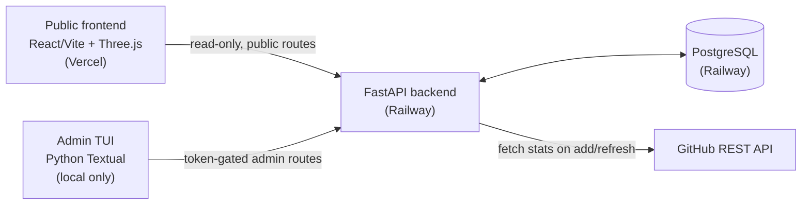

# Portfolio Platform

A scroll-driven, interactive portfolio site — projects render as suspended, reflective 3D cards that expand in place as you hover and scroll, backed by a real database and a terminal app as the only way to edit content.

<p align="center">
  <a href="https://frontend-eight-pi-44xatf0ts0.vercel.app"></a>
  
  
</p>

**Live: [frontend-eight-pi-44xatf0ts0.vercel.app](https://frontend-eight-pi-44xatf0ts0.vercel.app)**

## What this is

I'm a data science student shipping fintech and AI-agent side projects, and I wanted a portfolio that actually demonstrated build process instead of reading like a resume PDF with extra steps. This is that: a single page where each project is a physical-feeling object rather than a card in a grid.

Projects sit as polished, reflective slabs that gently sway in place. Hover one and scroll — the card expands smoothly in place, showing a live media preview, the project writeup, and a real-time GitHub stat card (stars, primary language) pulled from the GitHub API. Move to the next card mid-expand and the first one independently snaps back closed while the new one independently opens — nothing is choreographed against a single global scroll position. On mobile, where hover doesn't exist, the same interaction collapses to tap-to-expand, with click/tap working as a universal fallback on every device regardless of gesture support.

Content — project entries, the About section, the AI-workflow writeup — is never edited through an admin web form. A local terminal app (Python + Textual) is the sole write path, talking to the same backend the public site reads from over a token-gated admin API. The public frontend never has write access to anything, which keeps the attack surface on the deployed site to "read-only, nothing to inject into."

## Highlights

- **A real-time 3D interaction, not a canned animation.** One shared Three.js scene renders every project card as an independent mesh instance — same geometry, same renderer, each with its own resting tilt, idle-sway phase, and expand progress — rather than one WebGL context per card (a real performance ceiling at up to 6 simultaneous cards).
- **Hover-scoped scroll capture.** Scroll only drives the currently-hovered card's expand progress; the page scrolls normally everywhere else, and once a card is fully expanded, continued scroll moves *inside* its writeup rather than doing nothing. Built custom — the obvious reference component for this pattern hijacks the whole page's wheel events for a single full-viewport takeover, which doesn't repeat cleanly across multiple cards and has no click fallback.
- **A terminal app as a real admin tool, not a toy.** The TUI is the actual production write path — add/edit/reorder up to 6 project slots, edit page copy, trigger a GitHub stat refresh — pointed at the same live backend as the public site, not a separate local-only demo.
- **Genuinely dual-write-tested.** No formal unit test suite; instead, every real bug below was caught and verified through actual end-to-end interaction — headless Textual `run_test()` for the TUI, Playwright with real device emulation and CDP-level touch simulation for the frontend, real calls against the live API. See [Real bugs worth mentioning](#real-bugs-worth-mentioning).

## Architecture



- **Backend** — FastAPI + PostgreSQL on Railway. Public routes are read-only; a separate set of admin routes (token-gated, single-user) is the only way to write. The frontend never calls GitHub directly — stats are fetched backend-side and cached in the database, refreshed manually via the TUI rather than on a cron (acceptable staleness for stats that rarely change).
- **Frontend** — React + Vite + Three.js on Vercel, wired to the backend's public routes only. Fully static/serverless-shaped, no server-side logic of its own — matches the platform-fit rule this project locked in its own spec: Railway for anything holding real persistent connections, Vercel for everything else.
- **TUI** — Python Textual, never deployed, runs locally against either the local or production backend depending on its own `.env`. The sole write path for every piece of content on the live site.
- Both Railway and Vercel are GitHub-connected to this repo — pushing to `main` auto-deploys both.

## Tech stack

| Layer | Choice |
|---|---|
| Frontend | React 18, Vite, TypeScript, Three.js, Tailwind CSS 4 |
| Backend | FastAPI, SQLAlchemy, Alembic, PostgreSQL |
| Admin client | Python, Textual (TUI) |
| Hosting | Vercel (frontend), Railway (backend + Postgres) |
| External API | GitHub REST API (server-side only, PAT-authenticated) |

## Real bugs worth mentioning

Building the expand interaction and getting it right on real touch devices produced a few genuinely non-obvious bugs — keeping a short version here because the debugging process is as much the point of this project as the final interaction:

- **Mobile tap-to-expand fought itself across three separate fix attempts.** First pass: a fast swipe blew past several sections in one native momentum-scroll flick, fixed with a custom touch handler that takes the gesture over at the window level. Second pass: that fix broke tap-to-expand on real devices in a way a scripted Playwright tap couldn't catch, because a scripted tap fires zero `touchmove` events while real finger jitter routinely exceeds any reasonable pixel threshold for "this was a tap." Third pass, the actual root cause: the `touchend` listener was registered `{ passive: true }`, so its `preventDefault()` call was silently a no-op — confirmed via a real browser console error, not guessed — which let a native click fire alongside a manually-dispatched one and re-toggle a card mid-animation. Fixed by making the listener non-passive.
- **A 3D card face silently failed to texture, while the flat HTML fallback looked fine.** The same image URL was fetched by three different code paths in three different CORS modes (a plain ``, a CSS background, and a WebGL texture loader needing `crossOrigin="anonymous"`); whichever non-CORS request won the race left a cached response the CORS-mode fetch couldn't reuse. Diagnosed by tracing actual network requests, not by reading the code — the bug was invisible from source alone.
- **A Railway deploy failed with zero log output**, across multiple recreated services, looking exactly like transient infrastructure flakiness. Real cause: a missing explicit `deploy.startCommand` — Railway's Python auto-detection can't find an entry point for a nested `app/main.py` layout and fails before producing any build plan at all, silently. Fixed by setting the start command explicitly rather than chasing "flaky infra" as a first hypothesis.

## Running it locally

Requires Python 3.11+, Node 18+, and a local or Railway-provisioned PostgreSQL instance.

```bash
# backend
cd backend
python3 -m venv .venv && source .venv/bin/activate
pip install -r requirements.txt
cp .env.example .env   # fill in DATABASE_URL, GITHUB_TOKEN, ADMIN_API_TOKEN
alembic upgrade head
uvicorn app.main:app --reload --port 8017

# frontend
cd frontend
npm install
cp .env.example .env   # set VITE_API_BASE_URL
npm run dev

# tui — the sole write path; point it at local or production via its own .env
cd tui
python3 -m venv .venv && source .venv/bin/activate
pip install -r requirements.txt
cp .env.example .env   # set API_BASE_URL + ADMIN_API_TOKEN (must match the backend's)
python app.py
```

## Project layout

```
portfolio-platform/
├── backend/     FastAPI app — public + admin routers, GitHub stats service, Alembic migrations
├── frontend/    React/Vite app — Three.js card scene, dot-field background, scroll-expand interaction
├── tui/         Python Textual admin app — the only write path for site content
├── SPEC.md      Full spec: Definition / PRD / Technical Design / Design Brief
├── STATUS.md    Live build state, including every bug found and how it was fixed
└── CHANGELOG.md What shipped, in order
```

## Status

**Deployed and live**, both launch projects populated with real writeups and real linked GitHub repos — not seed data. No formal automated test suite; every feature (including every mobile interaction bug above) was verified through real end-to-end interaction against the actual running app rather than unit tests. See [`STATUS.md`](STATUS.md) for the full, non-aspirational build log, and [`CHANGELOG.md`](CHANGELOG.md) for what shipped and when.

**Deliberately out of scope for v1:** a blog/writing section, an in-page contact form, testimonials, resume PDF download, dark/light theme toggle, analytics, a custom domain, and `pipx` packaging for the TUI.

## License

[MIT](LICENSE) — see the license file for details.
